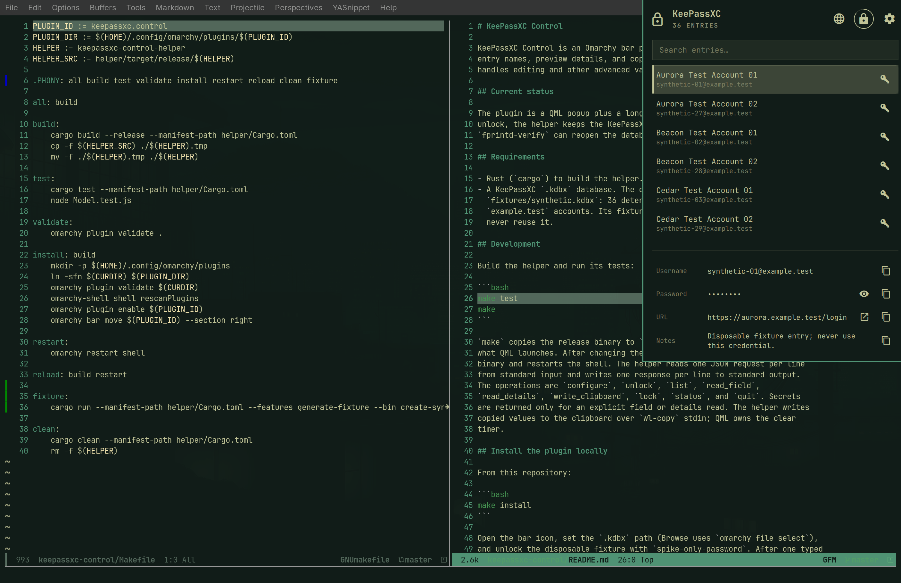

# KeePassXC Control

KeePassXC Control adds a password menu to the Omarchy bar. It helps you find
an item in your KeePassXC password file, view its details, and copy a
password, username, web address, or note.



During setup, you choose one KeePassXC `.kdbx` file. The plugin uses that file
until you choose another one.

The plugin reads the file but leaves changes to KeePassXC. It also leaves key
files, hardware keys, browser integration, and one-time passwords to
KeePassXC.

## Set it up

First, install the plugin from this repository:

```bash
make install
```

The install command adds an icon to the right side of the bar. Click it, select
your `.kdbx` file, enter the same password that you use in KeePassXC, and
choose **Unlock database**.

The plugin saves the file's location only after the password works. Otherwise,
it leaves the setup screen open for another attempt.

## Use it

Type in the search box to find an item by its title. Select it to see its
username, password, web address, and notes. Each field has a copy button.
Passwords stay hidden until you choose to show them. The plugin can open
`http` and `https` web addresses in your default browser.

Use the padlock button to lock the file in this plugin. Right-clicking the bar
icon does the same thing. By default, the plugin also locks after three
minutes without use and closes the menu.

## What happens after you lock it

The plugin has a small background program that runs with the Omarchy bar.
The first time you open the file, you type its password into the plugin. The
background program keeps that password in memory so it can open the same file
later.

After you lock the plugin, opening its menu usually asks for a fingerprint.
It uses your computer's fingerprint service, called through `fprintd-verify`
on Linux. If that route is unavailable or inconvenient, use the gear icon and
enter the password again.

It forgets the password when it stops, when you choose another file, or when
the stored password fails. Restarting the shell, a crash, and `make reload`
therefore require another password entry.

## Security model and limitations

This plugin is a convenience feature, rather than a new security boundary
around KeePassXC. It cannot protect passwords from someone who controls your
user account or computer.

Locking affects this plugin only. KeePassXC stays open if it already has the
same file open. The background program also keeps the password in memory so a
successful fingerprint scan can reopen the file.

Fingerprint scanning is a convenience check rather than encryption or a
replacement for the file password. This plugin keeps the password out of disk
storage, the system password store, and command lines. It remains in memory
until the background program forgets it. Locking and memory cleanup reduce
exposure, but memory inspection can still recover secrets.

The menu receives the details of the item you select so it can display and
copy them. Software that takes control of the Omarchy bar or its background
program can read those details while the plugin is unlocked.

Copying a value places it on the system clipboard. The plugin tries to clear
it after the configured delay. It cannot take back a value that another
program has already read, stored, synchronized, pasted, screen-recorded, or
captured with a keylogger.

Installation links Omarchy's plugin directory to this checkout. Anyone who
can change either location can replace the background program and capture the
next password entry. Install code that you trust and keep both locations
private.

## Requirements

You need Omarchy, a KeePassXC `.kdbx` file that opens with a password alone,
and `wl-copy` plus `wl-paste` for clipboard support. Rust is only needed when
you build from this repository. Fingerprint reopening additionally needs an
enrolled fingerprint and `fprintd-verify`; the password screen remains
available either way.

## Configuration

Most people can leave the settings alone. The default lock timeout is three
minutes. The default clipboard timeout is thirty seconds.

Omarchy stores these settings in `~/.config/omarchy/shell.json`, alongside
the plugin's bar entry:

```json
{
  "id": "keepassxc.control",
  "databasePath": "/path/to/database.kdbx",
  "idleTimeoutSec": 180,
  "clipboardTimeoutSec": 30
}
```

| Setting | What it changes | Default | Allowed values |
| --- | --- | --- | --- |
| `databasePath` | This is the path to the password file. The plugin writes it after a successful setup. | Empty | Any file path |
| `idleTimeoutSec` | This is the number of seconds before the plugin locks itself. | `180` | 30–3600 |
| `clipboardTimeoutSec` | This is the number of seconds before the plugin tries to clear a copied value. | `30` | 5–120 |

The setup screen changes only the password file. Change either timeout in
`shell.json` or run:

```bash
omarchy bar set keepassxc.control idleTimeoutSec 120 --json
omarchy bar set keepassxc.control clipboardTimeoutSec 10 --json
```

The new clipboard timeout applies when you copy the next value. The new lock
timeout applies the next time you open the password file, so lock and reopen
the plugin after changing it.

## Development

```bash
make test       # Rust helper tests and Model.test.js
make            # release helper → ./keepassxc-control-helper
make reload     # rebuild helper and restart the shell
make fixture    # regenerate fixtures/synthetic.kdbx
```

The test file contains 36 fake `example.test` accounts. Its password is
`spike-only-password`. Never use that password for anything else.

## Documentation

Product behavior is specified in [`SPEC.md`](SPEC.md). Agent working notes
are in [`AGENTS.md`](AGENTS.md).
